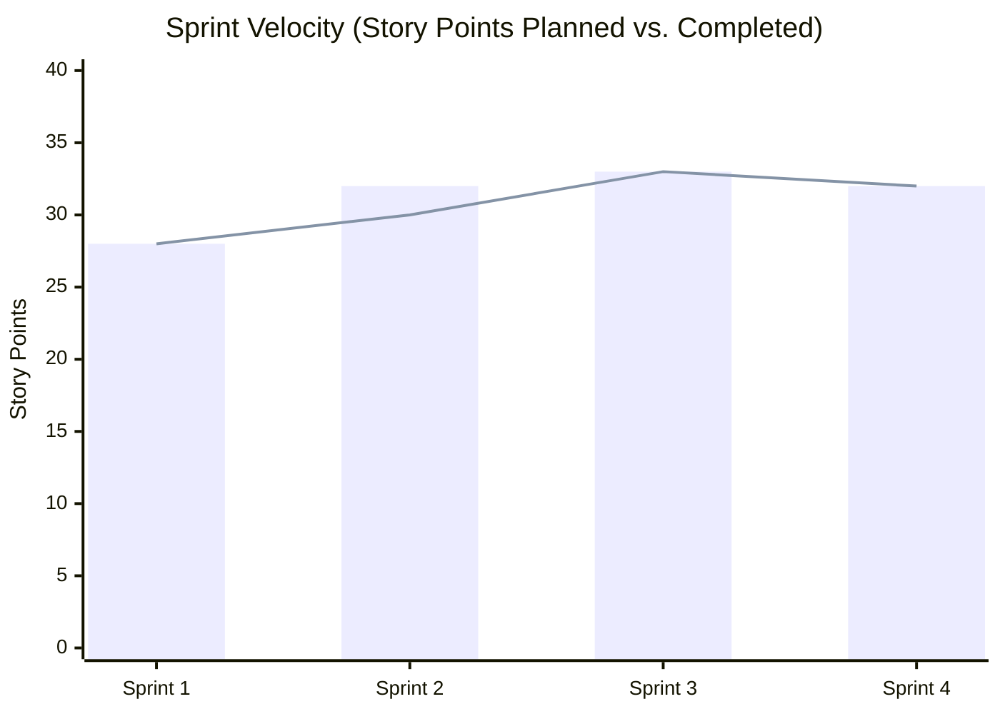

# QuickCare — Sprint Execution & Agile Ceremonies

## 1. Release Schedule Overview
The project was executed across **four 2-week development sprints**, preceded by Sprint 0 (Discovery) and followed by Hardening/Release.

```
[Week 1-3]   Sprint 0: Discovery, Architecture, UI/UX Wireframes
[Week 4-5]   Sprint 1: User Onboarding, Auth (OTP), Doctor Profile Setup
[Week 6-7]   Sprint 2: Doctor Directory, Search Filters & Appointment Booking
[Week 8-9]   Sprint 3: Telehealth Video Call Integration & Stripe Payments
[Week 10-11] Sprint 4: Digital Prescriptions, Pharmacy Tracking & MVP Polish
[Week 12-15] Hardening, HIPAA Security Audit, UAT & App Store Submission
```

---

## 2. Sprint-by-Sprint Execution Details

### Sprint 1: Foundation & Authentication
* **Sprint Goal:** Enable patients and doctors to securely register and manage their accounts.
* **Committed Points:** 28 | **Completed Points:** 28
* **Stories Included:**
  * `US-101`: Patient Registration via Phone SMS OTP (3 pts)
  * `US-102`: Doctor Registration & Medical License Upload (5 pts)
  * `US-103`: Doctor Profile Management (Bio, Specialties, Photo) (5 pts)
  * `US-104`: Patient Profile & Emergency Contact Setup (3 pts)
  * `TECH-101`: AWS Cloud Database & API Gateway Setup (8 pts)
  * `TECH-102`: CI/CD Mobile Build Pipeline Setup (4 pts)
* **Sprint Velocity:** 28 Points

---

### Sprint 2: Doctor Discovery & Scheduling Engine
* **Sprint Goal:** Allow patients to find doctors and book real-time appointment slots.
* **Committed Points:** 32 | **Completed Points:** 30 (2 pts spilled to Sprint 3)
* **Stories Included:**
  * `US-201`: Doctor Directory Search & Specialty Filtering (5 pts)
  * `US-202`: Doctor Weekly Availability Calendar Config (5 pts)
  * `US-203`: Patient Appointment Slot Picker & Booking Flow (8 pts)
  * `US-204`: In-App Appointment History & Status (Upcoming / Past) (5 pts)
  * `TECH-201`: Real-Time Slot Locking Mechanism (Redis) (5 pts)
* **Sprint Retrospective Action Item:** Break down complex slot-locking stories earlier during backlog grooming.

---

### Sprint 3: Video Calling & Payment Integration
* **Sprint Goal:** Deliver working 1-on-1 video consultations and complete in-app payments.
* **Committed Points:** 33 | **Completed Points:** 33
* **Stories Included:**
  * `US-301`: Twilio Video Room WebRTC Integration (8 pts)
  * `US-302`: Call In-Progress Controls (Mute, Camera Flip, Reconnect) (5 pts)
  * `US-401`: Stripe Payment SDK Integration (Credit/Debit, Digital Wallet) (5 pts)
  * `US-402`: Automatic Invoice Receipt & Email Dispatch (3 pts)
  * `US-403`: Refund & Cancellation Processing Flow (5 pts)
  * `SPILL-201`: Push Notifications for Doctor Booking Confirmation (2 pts)
* **Sprint Velocity:** 33 Points

---

### Sprint 4: Prescriptions, Pharmacy Delivery & End-to-End Polish
* **Sprint Goal:** Enable doctors to issue digital prescriptions, integrate express pharmacy delivery, and complete end-to-end MVP.
* **Committed Points:** 32 | **Completed Points:** 32
* **Stories Included:**
  * `US-501`: Doctor Digital Prescription Pad & Allergy Contraindication Engine (8 pts)
  * `US-502`: Patient Prescription PDF Viewer & Download (3 pts)
  * `US-503`: Pharmacy Express Delivery Tracking with Live Courier GPS (8 pts)
  * `US-601`: Automated Push Notifications (15-min call reminders) (3 pts)
  * `US-602`: Patient Post-Consultation Doctor Rating & Review (3 pts)
  * `QA-401`: Full Regression Testing across iOS & Android (7 pts)
* **Sprint Velocity:** 32 Points

---

## 3. Sprint Burndown & Velocity Summary



* **Average Velocity:** 30.75 Story Points / Sprint
* **Predictability Rate:** 98.4% (High delivery reliability)

---

## 4. Scrum Master Daily Standup Log (Sample)

| Date | Team Member | Yesterday's Achievement | Today's Goal | Blockers (Resolved by PM) |
| :--- | :--- | :--- | :--- | :--- |
| **Day 4 (Sprint 3)** | Eranga (Frontend) | Completed Stripe Payment Sheet UI | Connect Stripe test token to backend | **Blocker:** Missing Stripe Sandbox API test keys. <br>[Resolved] PM obtained and shared sandbox credentials from Lead Dev in 15 mins. |
| **Day 7 (Sprint 3)** | Ranjith (Backend) | Completed Twilio Video Room Webhook | Integrate reconnection logic on network drop | None |
| **Day 9 (Sprint 3)** | Nadeeka (QA Lead) | Executed 15 test cases for video calling | Test call drop behavior under 3G throttling | None |
