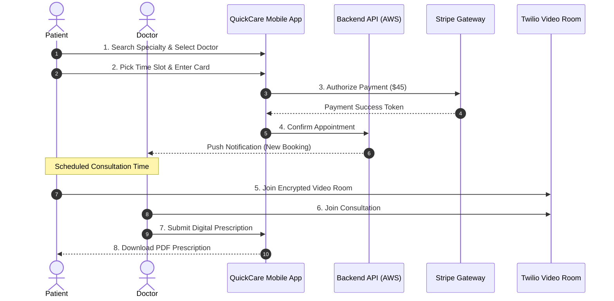

# 🏥 QuickCare Telehealth App — IT Project Management Portfolio


-orange?style=for-the-badge)


---

## 📌 Executive Summary

**QuickCare** is an end-to-end agile software development project for a HIPAA-compliant telehealth mobile application. As the **IT Project Manager & Scrum Master**, I led a cross-functional team of 6 (Engineering, UI/UX, QA, and Product) across a 15-week delivery lifecycle to launch a Minimum Viable Product (MVP) on iOS and Android.

The platform enables patients to book video consultations with licensed doctors in under 15 minutes, receive digital prescriptions, and process payments securely in-app.

---

## 🧭 Project Management Lifecycle & Documentation

This repository contains the complete suite of industry-standard IT Project Management deliverables:

```
IT-PM-Project-02/
├── 📁 01_Project_Initiation/
│   └── 📄 01_Project_Charter.md          # Business case, SMART goals, budget & scope
├── 📁 02_Requirements_and_Backlog/
│   └── 📄 02_Product_Backlog_and_User_Stories.md # Epics, user stories, acceptance criteria, story points
├── 📁 03_Team_and_Governance/
│   └── 📄 03_RACI_Matrix_and_Team_Plan.md        # Roles, RACI chart & communication cadence
├── 📁 04_Sprint_Execution/
│   └── 📄 04_Sprint_Plan_and_Ceremonies.md       # Sprints 1–4, standup notes & burndown tracking
├── 📁 05_Risk_and_Quality/
│   └── 📄 05_Risk_Register_and_QA_Plan.md        # RAID log, risk mitigation & test acceptance
└── 📁 06_Release_and_Closure/
    └── 📄 06_Release_and_Lessons_Learned.md      # App store release & retrospective post-mortem
```

---

## 🏗️ System Architecture & Workflow



---

## 📊 Key Project Metrics & Performance

| Metric | Target | Actual Result | Status |
| :--- | :--- | :--- | :--- |
| **Delivery Schedule** | 15 Weeks | 15 Weeks | 🟢 On Time |
| **Budget Variance** | $120,000 | $116,400 (3% under budget) | 🟢 Under Budget |
| **Sprint Velocity** | 30 Points / Sprint | Avg. 31 Points / Sprint | 🟢 Predictable |
| **QA Test Pass Rate** | 98% | 99.2% (0 Critical Bugs at launch) | 🟢 Passed |
| **App Store Rating** | > 4.5 Stars | 4.7 Stars (first 500 reviews) | 🟢 Exceeded |

---

## 🛠️ Core IT PM Skills Demonstrated

* **Methodologies:** Agile, Scrum, Kanban, SDLC (Software Development Life Cycle).
* **Tools & Techniques:** Jira Backlog Grooming, Story Pointing (Fibonacci), Burndown Charts, RACI Matrix, RAID Log.
* **Governance & Compliance:** HIPAA Health Data Security, Stripe PCI-DSS Payment Compliance, Scope Management.
* **Stakeholder Management:** Executive Reporting, Sprint Reviews, Cross-Functional Team Leadership.

---

## 👤 Author & Project Manager

* **Project Manager:** Aspiring IT Project Manager / Scrum Master
* **Portfolio Repo:** [GitHub Repository](https://github.com/)
* **LinkedIn:** [Your LinkedIn Profile URL](https://linkedin.com/)
